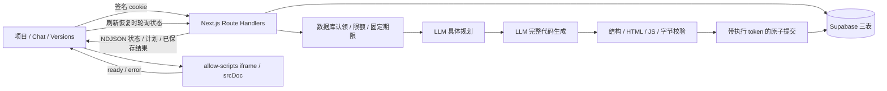

# Forge — 实现架构

状态：当前实现说明，对应最终 [PRD.md](./PRD.md)。不再描述未实现的指针恢复、轮询式首次生成或 Supabase Auth 会话方案。

## 结构与职责

单个 Next.js App Router 应用，Node.js 24、TypeScript、Tailwind CSS。Route Handlers 负责匿名会话、所有权检查、生成 / 恢复工作流和 Supabase 持久化。LLM 输出作为数据保存，仅由受限 iframe 执行。



正常生成是长 POST + NDJSON。刷新或同请求 202 重放后的恢复才每 2 秒读取状态，避免默认全量轮询。没有 fire-and-forget、任务队列或 Multi-Agent。

## 身份与权限

`POST /api/session` 复用或创建随机 UUID 匿名身份。签名 cookie 由 HMAC-SHA256 校验，HttpOnly、SameSite=Strict，有效期 30 天；身份来自 cookie，不来自请求 body。公开模式需独立 32+ 字符签名密钥和 12+ 字符访问密码，cookie 为 Secure。

公开访问密码由 Next.js proxy 和 API 身份 helper 校验，使用 HTTP Basic challenge；公开模式缺配置时拒绝页面 / API。部署必须使用 HTTPS。服务端 key 仅在服务器读数据库，浏览器无法获得它或调用业务表 / RPC。

所有者条件为 `projects.owner_id = verifiedSessionId`。列表查询显式筛选；加载 / 生成 / 更新 / 失败 / 完成 RPC 全部检查所有者；Restore 在读取源码前检查项目所有者，再由 RPC 重验。越权与不存在均返回 404。

三表保留 RLS 并撤销 anon / authenticated 的读写和 RPC 权限。这里采用受控 Route Handler + server credential，不采用 Supabase Auth JWT + 用户 RLS。签名 cookie、API 所有权和 RPC 所有权共同提供匿名隔离。服务器凭据仍必须保密。

旧共享数据的 owner_id 为 NULL，不对任何匿名访客自动开放；不会删除旧数据。不实现浏览器身份丢失后的自助找回。

## 实际数据库 Schema

迁移顺序：`001_persistence.sql` → `002_demo_hardening.sql`。没有新增第四张业务表。

| 表       | 字段                                                                                                                                                                                                                   |
| -------- | ---------------------------------------------------------------------------------------------------------------------------------------------------------------------------------------------------------------------- |
| projects | id、name、created_at、updated_at、owner_id                                                                                                                                                                             |
| messages | id、project_id、request_id、role、content、created_at、seq；助手工作流使用 status、phase、plan、error_code、base_version_id、deadline_at、run_token、finished_at、operation、source_version_id、attempts、attempted_at |
| versions | id（成功 requestId）、project_id、prompt、title、html、css、javascript、created_at、version_number、parent_id、model                                                                                                   |

约束继续包括消息 `(project_id,request_id,role)` 唯一、版本 `(project_id,version_number)` 唯一和源码字节限制。plan 保存 2–4 个用户可读步骤；用户消息不承载工作流状态。run_token 不返回前端。

`status=processing/completed/failed` 与 phase 0–4 持久化；完成状态只能通过保存版本的事务产生。没有当前版本指针，最大的 version_number 为最新版本。

## 短事务与并发

| RPC                      | 行为                                                                                                                                                                                           |
| ------------------------ | ---------------------------------------------------------------------------------------------------------------------------------------------------------------------------------------------- |
| forge_load_project       | 检查所有者；回收过期 processing；读取有序消息和版本。status_only 模式省略源码版本                                                                                                              |
| forge_begin_generation   | 短事务认领；项目锁与全局限额锁；相同 requestId 已完成返回已保存结果，进行中返回 202 所需状态；拒绝同会话其他活动操作和过期 / 错误基线；原子创建用户 + 助手占位；记录期限、run_token 和尝试次数 |
| forge_advance_generation | 必须匹配所有者、processing、run_token 和未过期期限；更新真实 phase / plan，phase 不回退                                                                                                        |
| forge_finish_generation  | 检查所有者、执行 token、期限和最新基线；原子追加版本、标记助手成功、更新项目；写入后再次检查期限，迟到写入整体回滚                                                                             |
| forge_fail_generation    | 若已成功，返回已提交成功结果；否则仅失败匹配 token 的 processing 记录，不能改写成功或新尝试                                                                                                    |
| forge_saved_result       | 内部读取成功快照，只有服务端角色可调用                                                                                                                                                         |

模型调用在短事务外执行。执行 token 是持久的 fencing token；进程重启、多个服务器和旧请求迟到都不能突破认领或改写新状态。旧 `forge_save_generation` 不再供服务端执行，避免绕过新保护。

限额在认领事务内检查：每匿名会话每小时 10 / 每天 30 次尝试；代码生成全局每小时 30 / 每天 100 次。失败重试也计数，进行中或完成重放不计数。重试使用同消息的累计尝试权重与最近尝试时间，限额统计偏保守；不是精确计费。全局限额使创建新匿名 cookie 不能无限触发付费调用。恢复也占用会话操作预算和活动锁。

## 生成、恢复与期限

Provider 提供 `plan` 和 `generate`。plan 返回严格 `{ steps: string[2..4] }`；generate 返回严格四字段 App。两次调用共享服务器信号和期限，修改时都接收数据库的当前完整代码。代码调用包含已保存计划；一次修正保持同一 prompt、App 和计划。

Planning 将需求与现有 App 包裹为 user 消息中的明确数据，并要求只返回步骤；不把 App 作为上一条 assistant 示例，以避免模型在规划阶段续写完整代码。Generation 仍将现有 App 作为完整上下文传入。规划无效时保存错误与重试入口，不进入代码生成。

从 Route Handler 入口建立总期限，包含请求准备、数据库认领、Planning、Generation、Validation 和 Save。fetch 绑定信号，等待操作受期限约束；数据库也检查固定 deadline_at。`GENERATION_TIMEOUT_MS` 为 1000–120000，默认 120000。部署需允许相应时长，maxDuration=150 不是宿主保证。

超时 / 网络错误后的终态确认最多 5 秒，使用独立短信号。若保存已按时提交但 HTTP 响应丢失，返回已保存成功，不写失败。若未提交，只能失败本次认领；数据库无法访问时保留状态到下次加载的期限回收。超过保存期限的事务不能新建版本。

Restore 读取同项目的校验后代码，使用同一认领 / 完成事务追加完整副本；不调用模型。v3 时恢复 v1 得到 v4，parent_id 为 v3；下一轮修改基于 v4，而不是切换回原 v1 指针。

## API 与前端恢复

| API                            | 输出 / 校验                                                                                      |
| ------------------------------ | ------------------------------------------------------------------------------------------------ |
| POST /api/session              | 复用匿名 cookie 或 Set-Cookie；返回会话 ID                                                       |
| GET /api/projects              | 当前匿名所有者项目列表                                                                           |
| POST /api/projects             | 严格 name 输入，所有者由服务器写入                                                               |
| GET /api/projects/:id          | project、messages、versions；`?view=status` 省略版本源码，读取实际状态                           |
| POST /api/generate             | projectId、requestId、baseVersionId、prompt；新认领 NDJSON，进行中重放 202，完成重放同一成功版本 |
| POST /api/projects/:id/restore | versionId、requestId、baseVersionId；成功返回新版本和两条消息；进行中重放 202                    |

NDJSON 事件：status、message、plan、complete、error。Completed 必须发生在数据库完成事务后。返回稳定错误码、可读消息，私有结果 no-store。

项目成功加载才更新 URL / 项目 / Chat / Preview。加载失败恢复当前已显示项目的 URL。刷新使用最后未完成用户请求与持久助手状态，保留旧 Preview，恢复失败重试或进行中轮询；孤立用户消息视为 interrupted，不显示虚假完成。

请求 / 项目双提交有同步引用保护，后端认领仍是权威。重复临时错误按请求合并，持久回复替换它。错误出现时滚动至恢复操作。

## Validation 与 Preview

Zod 校验结构，parse5 检查 HTML fragment / 外部资源，Acorn 检查语法及常见不支持能力。AST 检查区分局部绑定、普通属性 / 字符串与浏览器全局访问：`element.style.top`、局部 parent、文本 `"top"` 合法；未绑定 parent / top 和 `window['parent']` 等被拒绝。静态检查不宣称证明任意恶意代码安全。

srcDoc 使用可信外壳和转义后的 JSON 数据块，bootstrap 通过 textContent 安装 style / script。固定 `sandbox="allow-scripts"`、无 allow-same-origin，CSP 禁止网络 / 外部资源 / eval / forms。来源 iframe 和 token 校验后的消息仅报告 ready / error，不提供宿主能力。

JS error / unhandledrejection 不改变已保存版本，可 Reload Preview。iframe 无 CPU / 内存隔离；无限循环可能卡住浏览器。Preview 交互数据为内存，持久化的是项目、Chat、工作流状态与代码版本。

## 实际目录与测试

```text
src/app/api/session/route.ts
src/app/api/generate/route.ts
src/app/api/projects/route.ts
src/app/api/projects/[projectId]/route.ts
src/app/api/projects/[projectId]/restore/route.ts
src/components/app-builder.tsx
src/lib/ai/provider.ts
src/lib/projects/{schema,server,session}.ts
src/lib/generation/{schema,validate,errors,deadline,recovery}.ts
src/lib/preview/compose.ts
src/proxy.ts
supabase/migrations/{001_persistence,002_demo_hardening}.sql
tests/{generation,persistence}.test.ts
tests/helpers/database.ts
```

测试使用真实嵌入式 PostgreSQL 执行两份迁移和事务，HTTP 层和模型响应受控，不访问用户数据库或付费模型。浏览器故障 fixture 与真实 Supabase / LLM 验收分开记录。交付检查为 npm ci / test / lint / build；环境和演示步骤见 README。
