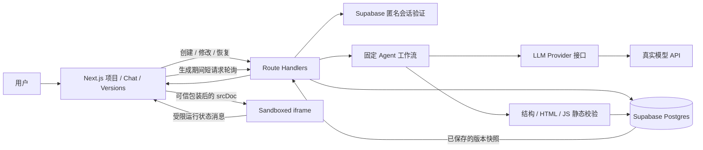

# AI App Builder MVP — Architecture

状态：设计提案，未实现。对应 [PRD.md](./PRD.md)。提交截止为 2026-10-10 22:00（Asia/Shanghai）。

## 1. 架构决策

采用单个 Next.js App Router 全栈应用：TypeScript、Tailwind CSS、Route Handlers、Supabase Postgres/Auth。shadcn/ui 仅在能直接节约时间时使用，不单独搭建组件体系。

后端负责身份检查、数据读写和固定 Agent 工作流；LLM provider 仅输出文本/结构化内容。生成代码作为数据库中的数据保存，只在浏览器的受限 iframe 中执行。生成过程没有 shell、依赖安装、仓库创建或服务端代码执行。

Route Handlers 可以承担请求/响应 API，见 [Next.js 官方文档](https://nextjs.org/docs/app/api-reference/file-conventions/route)。MVP 使用同步长 POST + 独立短 GET 状态轮询，不加入流式传输、后台 worker 或任务队列。



### 关键取舍

| 决策 | 原因 | 代价 |
| --- | --- | --- |
| 原生单页应用 | 无构建/依赖，便于立即执行 | 不支持复杂框架应用或生成后端 |
| 完整快照修改 | 避免 patch 匹配错误，便于恢复 | 每次传递和输出整份源码 |
| 三张业务表 | 覆盖项目、消息、版本；生成状态复用 Agent 消息 | messages 同时承载生成运行记录 |
| 匿名会话 | 不增加注册页面，仍能区分项目所有者 | 无跨设备身份恢复 |
| 轮询真实阶段 | 实现简单、刷新后可接续读取 | 不展示 token 级内容，短阶段可能被轮询跳过 |
| 请求内执行 | 无额外基础设施 | 不保证断开连接后继续运行，受宿主请求时限影响 |
| 少量数据库 RPC | 多表提交与互斥需要原子性 | 需要实现和验证几个小型事务函数 |

## 2. 模块职责

- **UI**：项目列表、Chat、Prompt、状态、版本选择；只把已保存版本交给 Preview。
- **API**：验证会话与输入，调用工作流和数据库事务；返回稳定错误码。
- **Generation service**：编排规划、生成、校验、一次有界修复、保存；不依赖 React。
- **Provider adapter**：封装特定模型 API、响应提取、超时/取消和错误归一化。
- **Validation**：schema、体积、自包含约束、HTML 解析与 JS 语法检查；不执行生成代码。
- **Preview composer**：构造宿主控制的 HTML 外壳、CSP、数据载荷和运行消息桥接。
- **Persistence**：查询、短事务、版本编号、当前指针、幂等和失效任务回收。

不增加通用插件系统、事件总线、复杂 repository 接口或 Agent framework。

## 3. 数据库 Schema

业务表仅 projects、messages、versions；用户身份使用 Supabase 已有 auth.users。UUID 默认 gen_random_uuid()，时间使用 timestamptz，默认 now()。源码分列存 text，避免 JSON 内重复保存同一份源码。

### projects

| 字段 | 类型 / 默认 | 约束与含义 |
| --- | --- | --- |
| id | uuid | PK |
| user_id | uuid | NOT NULL；FK auth.users(id)；只能由已验证身份决定 |
| name | text | NOT NULL；1–120 字符；初始名称与生成应用 title 分开 |
| current_version_id | uuid / NULL | 当前正式版本；初次生成前为空 |
| active_generation_id | uuid / NULL | 正在处理的 assistant message id |
| revision | bigint / 0 | NOT NULL；≥ 0；成功生成或有效恢复时递增 |
| created_at | timestamptz | NOT NULL |
| updated_at | timestamptz | NOT NULL；由业务事务维护 |

不另存容易与消息状态矛盾的 project.status；状态由活动 Agent 消息推导。

### messages

| 字段 | 类型 / 默认 | 约束与含义 |
| --- | --- | --- |
| id | uuid | PK；assistant 消息 id 也是 generation id |
| project_id | uuid | NOT NULL；FK projects(id) |
| seq | bigint generated always as identity | NOT NULL、UNIQUE；按 seq 确定消息顺序 |
| request_id | uuid | NOT NULL；客户端提交的幂等键 |
| role | text | NOT NULL；user / assistant / system |
| content | text / '' | NOT NULL；用户需求、结果说明或恢复记录；不复制源码 |
| reply_to_message_id | uuid / NULL | assistant 对应的 user 消息，同项目外键 |
| status | text | NOT NULL；processing / completed / failed |
| phase | text / NULL | planning / generating / validating / saving；仅 processing 使用 |
| plan | jsonb / NULL | 简短计划对象：summary 与 2–4 个 steps |
| base_version_id | uuid / NULL | 此次生成锁定的修改基线；首次生成为空 |
| base_revision | bigint / NULL | 此次生成开始时的 project.revision |
| started_at | timestamptz / NULL | assistant 运行开始时间 |
| deadline_at | timestamptz / NULL | 数据库时钟确定的固定期限 |
| finished_at | timestamptz / NULL | 成功或失败时间 |
| error_code | text / NULL | 归一化错误码 |
| error_message | text / NULL | 可向用户展示的错误，无 token/key/raw response |
| created_at | timestamptz | NOT NULL |

约束：UNIQUE(project_id, request_id, role)，UNIQUE(id, project_id)。user/system 始终 completed，且运行字段为空；assistant processing 必须有 phase、started_at、deadline_at、base_revision；结束时 phase 为空且 finished_at 非空。业务事务额外保证 assistant 恰好关联一条同轮 user 消息。

恢复操作创建 system 消息，记录“恢复到 vN”；仍只用三张表，不引入恢复事件表。

### versions

| 字段 | 类型 / 默认 | 约束与含义 |
| --- | --- | --- |
| id | uuid | PK |
| project_id | uuid | NOT NULL；FK projects(id) |
| version_number | integer | NOT NULL；> 0；项目内严格递增 |
| source_version_id | uuid / NULL | 新版本基于哪个历史版本生成；首次为空 |
| assistant_message_id | uuid | NOT NULL；同项目 assistant 消息；UNIQUE |
| title | text | NOT NULL；1–120 字符 |
| html | text | NOT NULL；body fragment |
| css | text | NOT NULL；可为空 |
| javascript | text | NOT NULL；可为空，但目标演示应用必须有实际交互 |
| provider | text | NOT NULL；实际适配器名称 |
| model | text | NOT NULL；实际模型标识 |
| created_at | timestamptz | NOT NULL |

约束：UNIQUE(project_id, version_number)，UNIQUE(id, project_id)。源码 UTF-8 总大小 ≤ 128 KiB，各源码字段 ≤ 64 KiB，在 API 与数据库 check 双层限制。

### 跨表约束与索引

- projects(current_version_id, id) → versions(id, project_id)，防止指向其他项目版本。
- projects(active_generation_id, id) → messages(id, project_id)，防止指向其他项目运行。
- messages(reply_to_message_id, project_id) → messages(id, project_id)。
- messages(base_version_id, project_id) 与 versions(source_version_id, project_id) → versions(id, project_id)。
- versions(assistant_message_id, project_id) → messages(id, project_id)。
- 跨表 role、status 和“活动指针必须是 processing assistant”通过事务函数检查。
- 索引：projects(user_id, updated_at DESC)、messages(project_id, seq)、versions(project_id, version_number DESC)。已有唯一索引可复用，不重复创建。
- 建表顺序：projects → messages → versions → ALTER TABLE 添加循环引用外键。创建项目时两个指针均 NULL，避免插入循环。
- MVP 不提供删除项目/版本 API；引用默认 NO ACTION，不添加未经验证的循环 cascade。

### RLS 与写入路径

三表开启 RLS。projects 的所有者条件为 auth.uid() = user_id；messages/versions 通过所属 projects 检查所有者。未经认证的 anon role 无业务表访问；匿名登录后的用户具有 authenticated 身份，见 [Supabase RLS](https://supabase.com/docs/guides/database/postgres/row-level-security)。

推荐业务写入只通过白名单事务函数，客户端不得直接改 version、指针或生成状态。撤销业务表对 anon/authenticated 的直接 INSERT/UPDATE/DELETE 权限；保留受 RLS 约束的 SELECT。

写入 RPC 因此采用最小范围 SECURITY DEFINER：固定 search_path、完全限定表名、撤销 PUBLIC/anon 执行权限，仅授予 authenticated；每个函数显式检查 auth.uid() 非空及项目所有权，不信任客户端传入 user_id。SECURITY DEFINER 可能绕过 RLS，所有权检查是函数内必须实现的边界。

不使用 service-role key 作为常规业务身份。直接 SELECT 走用户 JWT + RLS；事务调用也携带用户 JWT。生成相关 RPC 虽可被所有者直接调用，但只能修改自己的数据；MVP 不承诺防止所有者自行构造自己的源码版本，Preview 始终按不可信代码处理。

## 4. 数据库事务与版本一致性

所有事务只处理短数据库操作，**不在数据库事务内等待 LLM**。

| RPC | 原子操作 |
| --- | --- |
| create_project | 检查身份与名称；插入属于当前用户的空项目 |
| begin_generation | SELECT FOR UPDATE 锁项目；处理重复 request_id；回收过期运行；检查 revision/current_version；拒绝未过期活动运行；顺序插入 user/assistant；锁定基线、期限并设置活动指针 |
| advance_generation | 检查所有权、活动 id、期限与预期前一阶段；更新 phase/plan，禁止回退或覆盖终态 |
| complete_generation | 锁项目；检查活动 id、processing、未过期与 base_revision；分配 max(version_number)+1；插入版本；更新当前指针/revision；完成消息并清空活动指针 |
| fail_generation | 仅针对仍为当前活动的 processing 消息标记 failed；清空指针；保留旧版本；重复调用无副作用 |
| reconcile_generation | 仅回收 deadline_at 已过的活动记录为 failed/GENERATION_EXPIRED；不修改当前版本 |
| restore_version | 幂等检查；锁项目；拒绝生成中；检查 expectedRevision、同项目目标；切指针、revision+1、写 system 消息；不复制源码 |

新版本编号由持有项目锁的事务分配，恢复后不回退。complete_generation 和 fail_generation 用活动 generation id 作 fencing token：旧请求晚到不能影响后来请求。恢复到当前版本视为 no-op，不额外增加 revision。

同一 request_id 的生成重放：已成功返回同一个 version；进行中返回 202 与状态读取信息；失败返回原终态。用户主动“重试”才生成新的 request_id，避免误把重放当重试。

如果保存响应丢失，先查数据库终态，再决定是否报告失败；不能把已完成消息改成 failed。complete_generation 同样必须支持查询/返回已经提交的同一版本。

## 5. API Contract

使用 Route Handlers、Node.js runtime。私有页面与 API 不进行共享缓存，响应 Cache-Control: private, no-store。所有写请求检查会话、同源 Origin 与输入；鉴权身份来自验证后的 JWT，不来自请求 body。

| 方法与路径 | 输入 | 输出 / 行为 |
| --- | --- | --- |
| POST /api/session | 无 | 复用现有会话，否则匿名登录并写入会话 cookie |
| GET /api/projects | 无 | 当前用户项目摘要 |
| POST /api/projects | name | 201，空项目 |
| GET /api/projects/:id | 可选 view=status | 默认：项目、消息、版本元数据、当前版本源码；status 模式仅活动状态、计划、当前版本 id/revision，不传源码 |
| POST /api/projects/:id/generations | prompt, requestId, expectedRevision, baseVersionId | 首次请求在请求内等待工作流，成功 201；相同请求已完成 200、仍进行中 202；冲突 409 |
| POST /api/projects/:id/generations/reconcile | generationId | 仅回收已过期运行；返回权威状态 |
| GET /api/projects/:id/versions/:versionId | 无 | 指定同项目版本完整快照，用于临时查看 |
| POST /api/projects/:id/restore | versionId, expectedRevision, requestId | 返回更新后项目/current version 与恢复记录 |

统一错误形态：{ error: { code, message, requestId? } }。HTTP 400 输入错误、401 会话失效、404 不存在或不可访问、409 状态冲突、429 配额/上游限流、502 模型/结果错误、503 配置或服务不可用、504 总预算超时。

收到生成请求后，客户端立即开始短轮询；第一次轮询可能尚未看到 begin_generation，这时显示“提交中”，不能判定失败。轮询看到运行完成后停止并重新获取最新项目；GET 不隐式启动生成或修改数据。

## 6. Agent 工作流与 Provider Abstraction

### 输出契约

```typescript
type GeneratedApp = {
  title: string;
  html: string;        // 仅 body fragment，无 script/style/head
  css: string;         // 纯 CSS
  javascript: string;  // 纯 classic JS，无 TS/JSX/import
};

type AppPlan = { summary: string; steps: string[] };

interface AppGeneratorProvider {
  plan(input: GenerationContext, signal: AbortSignal): Promise<AppPlan>;
  generate(input: GenerationContext & { plan: AppPlan }, signal: AbortSignal): Promise<GeneratedApp>;
}
```

契约示意用于确认设计，不代表本轮已实现接口。Provider 内部将平台统一输出转换为特定 API 请求；repair 可复用 generate 并增加 validationFeedback，无需另建通用 Agent 协议。

环境变量：LLM_PROVIDER、LLM_MODEL、LLM_API_KEY、可选 LLM_BASE_URL；NEXT_PUBLIC_SUPABASE_URL、NEXT_PUBLIC_SUPABASE_PUBLISHABLE_KEY；GENERATION_TIMEOUT_MS。LLM key 仅服务端可读；BASE_URL 仅由部署配置控制，不能由用户输入，避免任意服务端请求。

首个真实 provider 在阶段 0 确定并验证结构化输出能力。更换同一适配器兼容的模型/端点用环境变量；不同 API 协议需要实现另一个 adapter，不能声称任意 provider 都能只改变量直接使用。未知 provider 或缺配置立即报错，绝不静默降级到 mock。

mock 只用于受控测试与早期闭环，UI 必须显式显示 Demo/Mock。最终验收必须包含真实模型。

### 顺序

1. 验证身份、Prompt 长度、request_id、项目与修改基线。
2. begin_generation 保存请求和占位消息，状态 planning。
3. 调用 plan，保存简短计划；随后进入 generating。
4. 调用 generate，取得完整结构化响应。
5. 进入 validating：校验字段/大小、自包含 HTML、安全约束与 JS 语法。
6. 可修复的格式/语法/约束错误最多请求一次修复，仍在同一 generation 和总时间预算内；phase 保持 validating，消息说明更新为“修复生成结果”，不让阶段倒退。
7. 进入 saving，complete_generation 原子提交版本与消息。
8. 前端从权威数据加载新快照，重建 iframe，展示成功结果。
9. 任一环节失败，fail_generation；旧 Preview 和 current_version 保留。

不是模型决定是否调用工具的循环。规划与生成默认是两次短/长模型调用；不为状态展示伪造 Planning。

### 上下文

每次包含系统约束、新 Prompt、当前正式版本的 title/html/css/javascript、首次需求，以及最近至多 6 条已完成 user/assistant 消息。system 恢复记录、错误信息和旧版源码不当成修改指令。

恢复历史版本后以恢复的源码为权威基线，明确标注“历史对话仅供参考，未要求恢复的旧功能不应自动重新加入”。当前源码不可盲目裁剪：超出配置模型的上下文预算时先移除历史消息，仍超限则提示需求过大。模型最大输出预算必须与输入预算共同验证；128 KiB 是存储上限，不保证任意模型能生成同等大小代码。

## 7. Preview 组成、隔离与限制

### 宿主控制的组装

iframe 固定 sandbox="allow-scripts"、srcDoc、referrerPolicy="no-referrer"。不给 allow-same-origin、allow-top-navigation、allow-popups、allow-forms 或 allow-downloads。保留 allow-scripts 才能实现真正交互；不赋予同源能力，参考 [MDN iframe](https://developer.mozilla.org/en-US/docs/Web/HTML/Reference/Elements/iframe)。

不用简单字符串拼接原始 CSS/JS 到 style/script 标签。Preview composer 生成固定 HTML 外壳，将源码 JSON 序列化并转义 `<`、`>`、`&`、U+2028/U+2029，放入不可执行的数据块；可信 bootstrap 解析数据，将 CSS 通过 style.textContent 注入、HTML 作为已校验 fragment 插入、JS 通过新 script 元素的 textContent 执行。这样代码中的字面量 `</script>` / `</style>` 不会提前关闭外壳标签。title 在宿主显示时按普通文本渲染。

服务端用 HTML parser 检查并规范化 fragment，不靠正则判断 HTML 安全性：拒绝 script、style、html/head/body、iframe、object、embed、base、meta、link、外链资源、内联 on* 事件、javascript URL、SVG 外部引用。图片允许受限 data 格式；链接仅允许页内锚点；表单允许 JS 事件处理但拒绝 action/formaction。违反约束触发有界修复，不能静默删除核心交互后仍宣称成功。

宿主头部 CSP 初始策略：

```text
default-src 'none';
script-src 'unsafe-inline';
style-src 'unsafe-inline';
img-src data:;
connect-src 'none';
font-src 'none';
media-src 'none';
object-src 'none';
frame-src 'none';
worker-src 'none';
base-uri 'none';
form-action 'none';
```

CSP 是宿主策略，放在任何应用内容之前；生成内容不能提供自己的 head/meta。inline JS/CSS 是本产品执行方式，因此有意允许 unsafe-inline；不允许 unsafe-eval。策略参考 [MDN CSP](https://developer.mozilla.org/en-US/docs/Web/HTTP/Reference/Headers/Content-Security-Policy)，实现阶段必须在目标浏览器验证，不将 CSP 宣称为完整恶意代码隔离。

### 运行消息与交互

可信 bootstrap 在加载应用前注册 error / unhandledrejection，执行后报告 ready。每次 iframe 挂载使用新的 frame token；父页面检查 event.source === iframe.contentWindow、token、消息 type 和负载大小。无同源权限时 origin 可能是 "null"，不能只凭 origin 判断可信度。桥接仅更新 ready/error UI，不提供数据库、网络、文件或其他宿主能力。

ready 仅说明脚本加载流程完成，不等于交互全部正确；晚到运行错误仍可显示。运行错误属于 Preview 状态，不回滚已保存版本。修复通过用户后续 Prompt 完成，MVP 不增加运行错误自动修复循环。

Preview 按 version id 和 reload key 重建；输入 Prompt、轮询状态或 Chat 更新不能反复重载 iframe。临时查看历史版本使用独立 previewVersionId，不修改 project.current_version_id。

生成代码不得依赖 localStorage、sessionStorage、IndexedDB、cookies、fetch、动态 import、eval/new Function、parent DOM 或外部 API；使用内存状态，并禁止修改 location 或主动导航。CSP 与 sandbox 不能保证阻止所有恶意代码的网络行为，例如 iframe 自身导航；本版针对受约束的生成式 Demo，不作为公开运行任意恶意代码的服务。sandbox 也不提供进程级资源隔离：死循环可能卡住标签页，不能保证宿主可强制中断。MVP 通过模型约束、源码上限和基本静态检查降低风险，且不把它描述为通用代码沙箱。

## 8. 超时、刷新与异常恢复

单次整体期限初始为 120 秒；所有 provider 调用共享同一 deadline 与 AbortController。规划目标预算约 15 秒，生成约 75 秒，剩余预算用于校验/一次修复/保存；不另开无限重试。数据库 begin_generation 写固定 deadline_at，后端在期限前停止调用，数据库提交也检查期限。

刷新后重新获取项目、Chat、当前源码和活动生成；未到期限继续轮询。已过期时显式调用 reconcile，并显示可重试。服务进程被终止无法保证 catch 执行，回收依赖数据库期限，不能仅靠进程内 finally。

连接中断时先查状态；后台请求可能已提交，也可能被宿主中止。本版不承诺任务在页面关闭后必然完成。不要返回 202 后在进程内 fire-and-forget 执行 LLM；只有重复请求发现已有运行时才返回 202。

部署前验证宿主允许的执行时间：目标至少覆盖 120 秒预算及少量余量（约 150 秒）。配置 maxDuration 不代表宿主一定支持；若宿主限制更短，应缩短模型/总预算或使用可维持 Node.js 请求的运行方式。遇到限制不临时添加未设计的后台队列。

模型错误、超时、权限错误、格式错误与保存错误分开归一化。日志仅记录 request/generation/project id、provider/model、阶段耗时、错误码，不打印 API key、完整源码和原始模型响应。

## 9. 建议目录结构

以下是确认后创建的结构；当前仅 PRD.md 和 ARCHITECTURE.md 存在。

```text
forge/
├── PRD.md
├── ARCHITECTURE.md
├── README.md
├── .env.example
├── package.json
├── <package-manager lockfile>
├── src/
│   ├── app/
│   │   ├── layout.tsx
│   │   ├── page.tsx
│   │   ├── globals.css
│   │   ├── projects/[id]/page.tsx
│   │   └── api/
│   │       ├── session/route.ts
│   │       └── projects/
│   │           ├── route.ts
│   │           └── [id]/
│   │               ├── route.ts
│   │               ├── generations/route.ts
│   │               ├── generations/reconcile/route.ts
│   │               ├── versions/[versionId]/route.ts
│   │               └── restore/route.ts
│   ├── components/
│   │   ├── projects/project-list.tsx
│   │   ├── workspace/project-workspace.tsx
│   │   ├── chat/chat-panel.tsx
│   │   ├── chat/prompt-input.tsx
│   │   ├── chat/generation-status.tsx
│   │   ├── preview/app-preview.tsx
│   │   └── versions/version-history.tsx
│   ├── hooks/use-generation.ts
│   ├── lib/
│   │   ├── ai/
│   │   │   ├── provider.ts
│   │   │   ├── factory.ts
│   │   │   ├── prompts.ts
│   │   │   └── providers/{real-adapter,mock}.ts
│   │   ├── generation/{service,context,validate}.ts
│   │   ├── preview/{compose,bridge}.ts
│   │   ├── supabase/{browser,server,session}.ts
│   │   ├── persistence/{projects,generations,versions}.ts
│   │   └── {env,errors,schemas}.ts
│   └── types/{domain,database}.ts
├── supabase/migrations/
│   ├── 001_schema_rls.sql
│   └── 002_workflow_functions.sql
└── tests/
    ├── fixtures/
    ├── generation-validation.test.ts
    ├── workflow.integration.test.ts
    └── builder.e2e.spec.ts
```

大括号表示同一目录下的建议文件，并非真实文件名。会话刷新适配入口按照实施时锁定的 Next.js/@supabase/ssr 版本确定；服务端验证和 cookie 刷新方式遵循 [Supabase SSR 文档](https://supabase.com/docs/guides/auth/server-side/creating-a-client?queryGroups=framework&framework=nextjs)。

## 10. 验证策略与扩展位置

必要验证聚焦会破坏闭环的行为，不给纯展示组件堆镜像测试：

- **静态校验测试**：非法 JSON/字段、超大输出、外部依赖、语法错误、特殊结束标签。
- **数据库集成测试**：所有者隔离、跨项目外键、同 request_id 幂等、双标签并发、原子提交、过期回收、迟到结果、恢复后编号。
- **浏览器闭环测试**：fixture 快速覆盖创建→生成→真实交互→修改→刷新→恢复→再次修改；验证 iframe 不能访问 parent，运行错误可显示。
- **真实模型冒烟**：待办、计算器、番茄钟三类应用及连续修改；验证真实配置不走 mock，手动操作核心交互。
- **交付检查**：类型检查、适用的 lint、生产构建、环境缺失提示、按 README 干净启动/部署。

未来扩展保持局部：新增 provider adapter；将 generation service 搬到 durable worker；匿名身份升级账号；增加导出。生成 App 数据持久化、任意代码执行、资源隔离、IDE 和 React repository 都需要新的产品/安全设计，不属于本版接口已经支持的能力。

## 11. 实施前的决策状态

方案推荐值已明确；尚待实际配置的是 provider/model、Supabase 项目和部署环境。实施阶段 0 先验证这三项，再搭界面，避免最后才发现无法调用模型或请求时限不够。

本轮到此停止。确认后按 PRD 中的阶段推进，不提前安装依赖、创建应用骨架或实现 migration。
